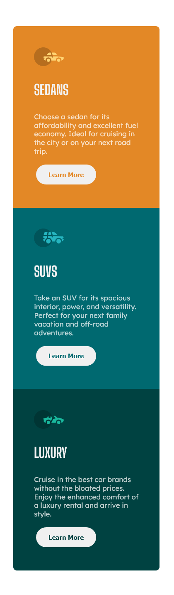

# 3-column preview card component solution

This is a solution to the [3-column preview card component challenge on Frontend Mentor](https://www.frontendmentor.io/challenges/3column-preview-card-component-pH92eAR2-).

## Table of contents

- [Overview](#overview)
  - [The challenge](#the-challenge)
  - [Screenshot](#screenshot)
  - [Links](#links)
- [My process](#my-process)
  - [Built with](#built-with)
- [Author](#author)

## Overview

### The challenge

Users should be able to:

- View the optimal layout depending on their device's screen size

### Screenshot

Desktop implementation:

Mobile implementation:

### Links

- [Solution URL](https://github.com/mariamihai/fm-3-column-preview-card-component)
- [Live site URL](https://mariamihai.github.io/fm-3-column-preview-card-component/)

## My process

The designs were created for mobile (375px) and desktop (1440px).

The colors used were the ones provided in the guide of the challenge.

Used [Lexend Deca](https://fonts.google.com/specimen/Lexend+Deca) and [Big Shoulders Display](https://fonts.google.com/specimen/Big+Shoulders+Display) font families with 15px.

### Built with

- Semantic HTML5 markup
- CSS custom properties
- Flexbox
- Mobile-first workflow

## Author

- Frontend Mentor - [@mariamihai](https://www.frontendmentor.io/profile/mariamihai)
